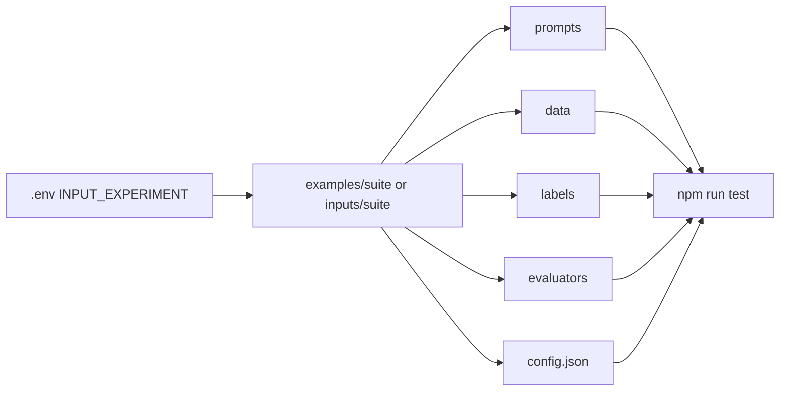
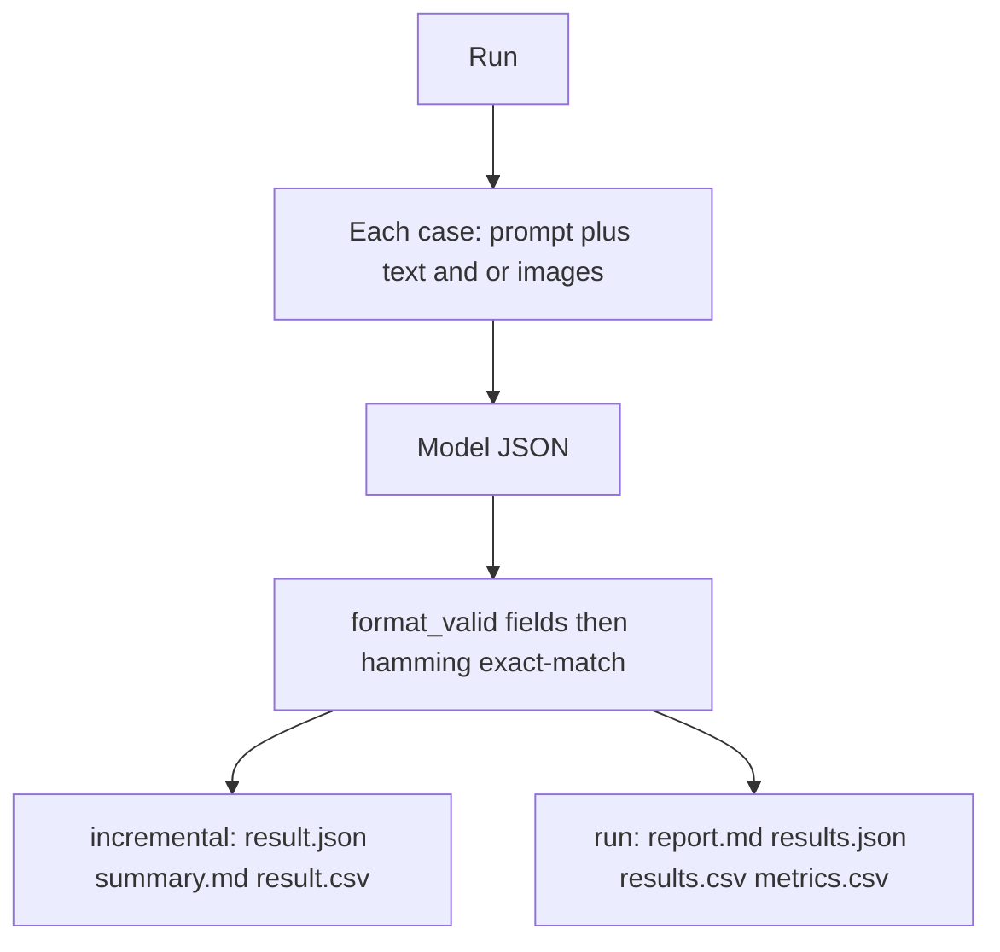

# Prompt evaluation

Score a **prompt × model × case** grid against gold labels. Each run writes a report a data scientist can open without knowing how the harness is wired.

## Setup

- Node 18+
- An OpenAI-compatible server (`GET /v1/models`, `POST /v1/chat/completions`)
- Copy `.env.example` to `.env` and set at least:
  - `MODEL_SERVER_URL`
  - `INPUT_EXPERIMENT=cat-detector-suite` (folder name under `examples/` or `inputs/`)

Optional: `API_KEY` for `Authorization: Bearer` on `/v1` (Groq, Together, OpenAI, vLLM `--api-key`, LM Studio with a key). Omit for local servers with no key. Also optional: `DEFAULT_MODELS`, Slack webhook. Suite-specific settings (`temperature`, schema, token cap, models) live in `{suite}/config.json` and override env.

Shipped suites live in `examples/`. Your own suites go in `inputs/` under a **different** name — the runner does not treat `inputs/{name}` as an override of `examples/{name}`.



## Suite layout

`examples/{suite}/` (bundled) or `inputs/{suite}/` (yours):

| Path | Role |
|------|------|
| `prompts/` | `system_*.txt` and `user_*.txt` (same suffix = a pair) |
| `data/` | Cases: `.txt`, images, or both |
| `labels/` | Gold JSON, never in `data/` |
| `evaluators/` | Scoring |
| `schemas/` | Optional response schema |
| `config.json` | Temperature, structured output, models |

Example: `examples/cat-detector-suite/`. See that folder’s README for buckets and fields.

## Evaluators

Each suite may export two functions from `evaluators/`:

```js
evaluateQuantitative(parsed, { input_data_file }) → {
  fields: { [name]: { predicted, gold, correct } },
  format_valid: 0 | 1,   // omit if the suite has no schema check
  bucket?: string,
  errors: string[]
}

evaluateQualitative(parsed, { input_data_file }) → {
  strengths: string[],
  weaknesses: string[],
  suggestions: string[]
}
```

The harness then adds:

- **`hamming_accuracy`** — mean field match (correct labels / N)
- **`exact_match`** — 1 only if every scored field matches gold
- **`macro_f1`** — unweighted mean of per-label F1 over the run (sklearn `average="macro"`, `zero_division=0`). Written once per model in `metrics.csv`, not on sample rows.
- **`brier`** — harness score of **`stated_confidence`**: `(stated_confidence − exact_match)²` (sklearn `brier_score_loss`). `stated_confidence` is the model’s self-grade, not computed by the harness. Empty if the JSON has no `stated_confidence` in `[0, 1]`; not mixed into Hamming / F1.

`format_valid` is a gate (pass/fail), not mixed into Hamming / F1. Gold labels are never sent in the prompt.

## Run

```bash
npm install
npm run test-connection
npm run test
```

`npm run test` loads every user prompt × every case × every available model from `DEFAULT_MODELS` / `config.json`.

## After a run

Open `results/{experiment}/run_{timestamp}/` in this order:

1. **`report.md`** — task, data, Hamming / exact match / macro-F1, misses, fields, breakdowns
2. **`results.csv`** — one row per case
3. **`metrics.csv`** — one row per model plus `all`
4. **`results.json`** — full records, including model JSON

Per-model splits are `{model}_results.csv` (same sample schema as `results.csv`). Each case also lands under `incremental/` as `result.json`, `summary.md`, and `result.csv`.

### `results.csv`

Identity: `id`, `timestamp`, `experiment`, `model`, `prompt_name`, `input_data_file`, `input_kind`, `bucket`, `format_valid`.

Per field, in `report.json` order: `gold_{field}`, `pred_{field}`, `correct_{field}`. Booleans are `0`/`1`. Missing cells are empty (not `N/A`), so pandas can coerce to float/bool.

Sample scores: `hamming_accuracy` (0–1), `exact_match` (`0`/`1`), `stated_confidence` (copied as-is) and harness `brier` when present, `miss_count`, `processing_time` (ms). Run-level `macro_f1` is not on these rows.

### `metrics.csv`

One row per model plus `model=all`: `experiment`, `model`, `n`, `format_valid_rate`, `hamming_accuracy`, `exact_match`, `macro_f1`, `mean_stated_confidence`, `brier`, and `precision_{field}` / `recall_{field}` / `f1_{field}`. `mean_stated_confidence` and `brier` are empty when no row has `stated_confidence`.

```python
import pandas as pd

samples = pd.read_csv("results.csv")
metrics = pd.read_csv("metrics.csv")

samples[["gold_domestic_cat", "pred_domestic_cat", "correct_domestic_cat"]]
metrics.loc[metrics["model"] == "all", ["n", "hamming_accuracy", "exact_match", "macro_f1"]]
samples.plot.scatter(x="stated_confidence", y="exact_match")
```



Labels are never sent in the prompt. `task` / `user` excerpts in artifacts are the instruction text only.
